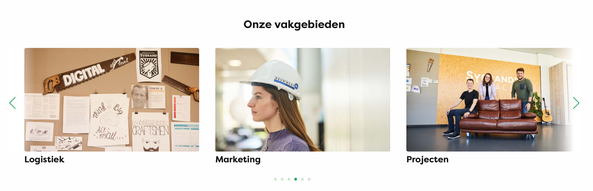
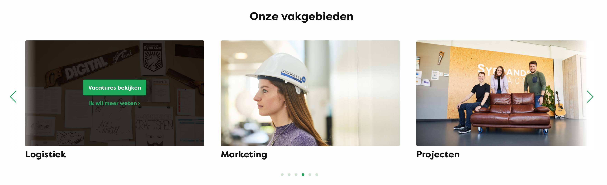

# Development

## Graphics

Guide on how to add graphics to specific sections on the page.


List of classes that render the different graphics + positions:
- graphic-1-left
- graphic-2-left
- graphic-3-left
- graphic-1-right
- graphic-2-right
- graphic-3-right
- graphics-2-3 (as shown in image above)
- graphics-sides-1
- graphics-sides-2

### Guide

1. group section and add one of the classes listed above + add class `full-width-section` if you want the graphics to use the full width.

2. inside of the group, create another group with class `inner-wrapper`. 


## Image slider

Guide on how to add content for the image slider on the stages and traineeships page. 


### Image
Select image from media library 


### Text
--> Shown underneath the image


### Image Overlay


#### Link Url
--> Select url for each link

#### Link Text


#### Button
Select if link should be styled as a button


## Partner logos

Styling for .partner-logos, .text-partner-logos

## hover
On default and mobile, figcaption is hidden. 
On hover figcaption is visible on desktop. 

```
figure:hover figcaption {
    visibility: visible;
    opacity: 1;
}
```