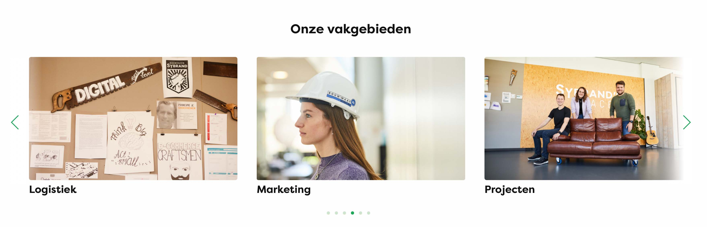
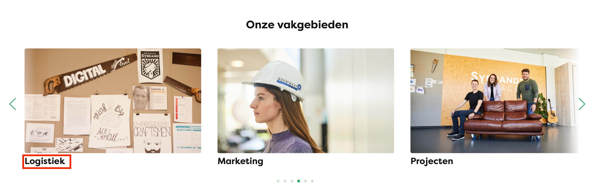
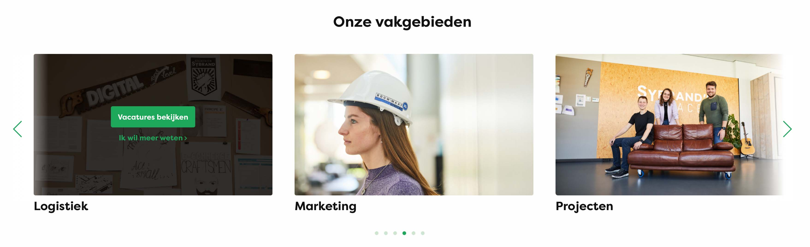

# Image SLider
Guide on how to add content for the image slider on the stages and traineeships page. 

### Image
Select image from media library 

### Text
--> Shown underneath the image

### Image Overlay

#### Link Url
--> Select url for each link

#### Link Text

#### Button
Select if link should be styled as a button
