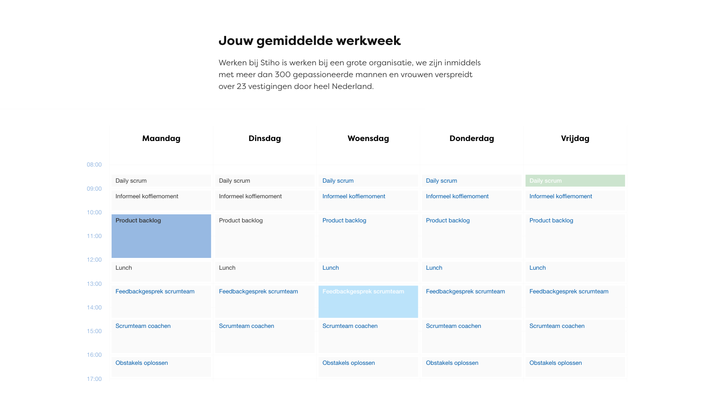

# Testimonials

Guide on how to create/manage and add testimonials to vacancies. This also covers setting up default testimonials for new vacancies based on the vacancy category.

## Creating testimonials

1. Log into Wordpress and navigate to “Testimonials”

2. Click “Add new” at the top of the page to create a new testimonial

3. Click “Add title” and write down the name of the person who gave the testimonial

4. Click “Type / to choose a block” and write down the testimonial / quote

5. On the top right of the page you will see 2 tabs called “Testimonial” and “Block”. Make sure “Testimonial” is selected

6. (Optional) Click “Set featured image...” and choose / upload a portrait image of the person who gave the testimonial / quote

## Adding testimonials to vacancies

1. Log into Wordpress, navigate to “Vacancies” and click on the vacancy for which you would like to manage the testimonials.

2. Scroll down until you see “Job testimonials”

3. You will see 2 columns, in the left there will be a list of existing testimonials. In the right column you’ll the testimonials that are added to this testimonial. It could be testimonials were already added to the right column because of the default testimonials functionality.

4. Click on testimonials in the left column to move them to the right column. This also works the other way around.

5. Make sure to click “Update” at the top of the page to save any changes you made to this vacancy.

# Setting up default testimonials based on vacancy category

1. Log into Wordpress and navigate to “Global settings”

2. Navigate to “Default gallery and testimonials”

3. Add a new vacancy category by clicking “Add item” at the bottom of the page

4. Choose the images and/or testimonials that should be added as default when a vacancy of that category is created in Recruitee

5. Once you’re done, make sure to click “Update” at the top of the page
