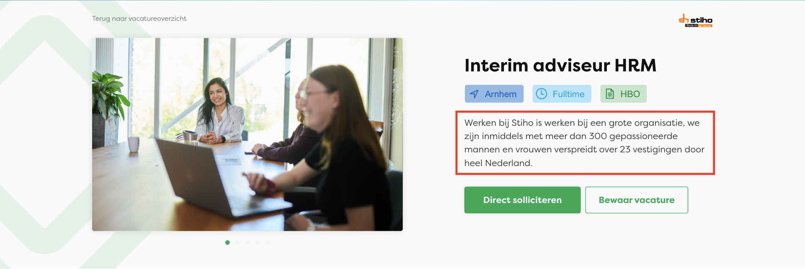
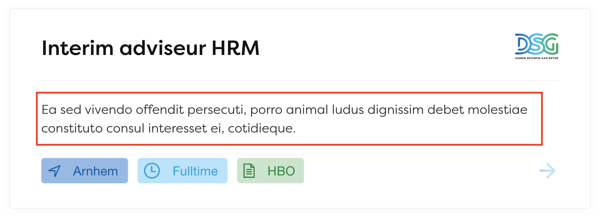
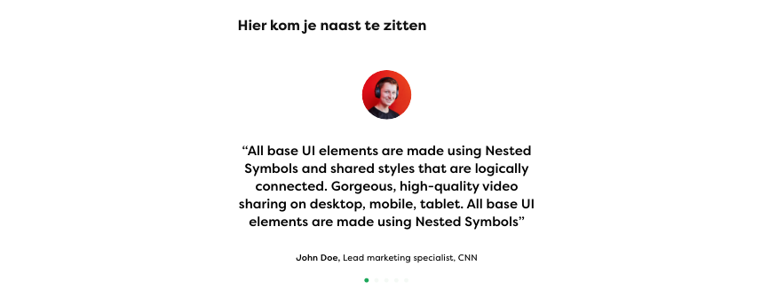

# Vacancies

Guide on how to add the additional content for each vacancy.

### Job short description (required)
--> Shown on top of the page, below the Vacancy title and tags.

### Job Excerpt (required)
--> Shown on the card on the vacancy index.

### Job gallery (required)

### Job testimonials

### Working schedule
