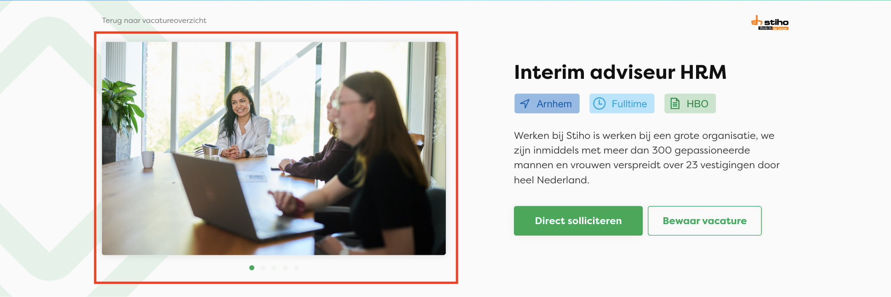

# Vacancies

Guide on how to add / change additional content for individual vacancies. For a lot of this content default content can be setup under "General Settings" in Wordpress. The default content can be changed / expanded per vacancy.

1. Log into Wordpress, navigate to “Vacancies” and click on the vacancy for which you would like to manage the content.

2. After changing the content make sure to click "Update" at the top of the page to save your changes.

### Job short description (required)
--> Shown on top of the page, below the Vacancy title and tags.

### Job Excerpt
--> Shown on the card on the vacancy index.

### Job gallery (required)

### Job testimonials

### Working schedule
