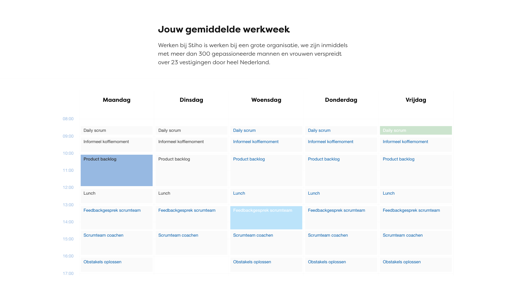

# Vacancy images

Guide on how to manage images for vacancies. This mainly covers setting up default images for new vacancies based on the vacancy category.

## Setting up default images and testimonials per vacancy category

1. Log into Wordpress and navigate to “Global settings”

2. Navigate to “Default gallery and testimonials”

3. Add a new vacancy category by clicking “Add item” at the bottom of the page

4. Choose the images and/or testimonials that should be added as default when a vacancy of that category is created in Recruitee

5. Once you’re done, make sure to click “Update” at the top of the page
